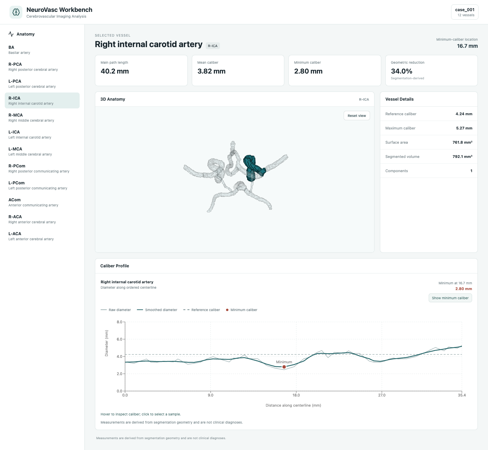
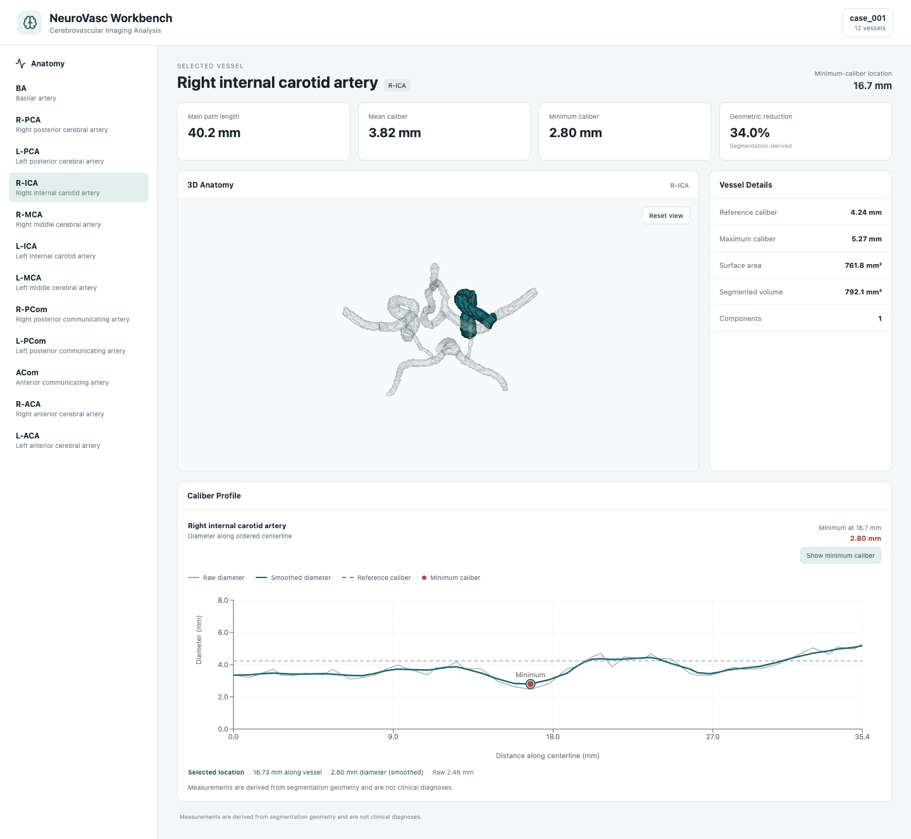

# NeuroVasc Workbench

Interactive cerebrovascular imaging and quantitative geometry workbench for Circle-of-Willis analysis.

**Research/engineering prototype — not diagnostic medical software.** Synthetic geometric validation is not clinical validation.

## Overview

NeuroVasc turns labeled cerebral vascular segmentations into an interactive workspace for anatomical vessel selection, physical geometry, caliber profiles and spatially linked measurements. The UI keeps the vascular network visible while highlighting the selected vessel and linking chart samples to their physical 3D coordinates.

## Demo

[Project overview on my portfolio](https://yramtirey.github.io/projects/neurovasc-workbench/). The portfolio shows actual captures; the interactive workbench runs locally.

Run the workbench locally with an independently obtained annotated segmentation, using the steps below. There is no hosted live demo. The captures below are from the running application using the attributed TopCoW/IXI example. See [image attribution and license](assets/README.md).





## Features

- Anatomy-aware Circle-of-Willis visualization and named-vessel selection.
- NIfTI loading with physical voxel spacing and affine coordinates.
- Centerlines, vascular graphs, branch measurements and Distance Metric tortuosity.
- Raw/smoothed segmentation-derived caliber profiles, reference caliber and candidate relative reduction.
- Interactive profile-to-3D point linking and camera reset.
- Case-level CSV/JSON analysis and VTP geometry served by FastAPI.
- Analytic synthetic validation, explicit failures and literature-backed method decisions.

Lee skeletonization and EDT-derived caliber are the production baselines. Cross-sectional equivalent diameter, geodesic recovery/refinement, hybrid fallback and loop-aware topology/refinement remain experimental; they are not silently enabled in the case pipeline.

## Architecture

```text
Labeled NIfTI segmentation
          ↓
Python analysis engine
          ↓
geometry / centerlines / topology / caliber
          ↓
case JSON + VTP + caliber profiles
          ↓
FastAPI → React + TypeScript + VTK.js + Recharts
          ↓
Interactive workbench
```

## Validation

| Milestone | What it tests |
|---|---|
| [Caliber v1](docs/validation/caliber_validation_v1.md) | EDT versus analytic diameters; 52 runs, overall MAE 0.201283 mm |
| [Caliber v2](docs/validation/caliber_validation_v2.md) | Experimental CE versus EDT; 92 scorable pairs and 24 upstream failures |
| [Centerline v1](docs/validation/centerline_validation_v1.md) | Recovery, geometric error and coverage against analytic paths |
| [Centerline v2](docs/validation/centerline_validation_v2.md) | Physical refinement, hybrid QC and failure analysis |
| [Topology v1](docs/validation/topology_validation_v1.md) | 76 networks; new method preserves ranks, but full connectivity succeeds in 58 |
| [Topology v2](docs/validation/topology_validation_v2.md) | Geometry refinement retains structure; coverage regressions remain explicit |
| [External methods v1](docs/validation/external_methods_benchmark_v1.md) | Actual VMTK comparison with separate seed modes/support; Slicer CE unavailable |

The [curated public results](validation/public_results/README.md) preserve numerical evidence and representative figures without distributing thousands of generated artifacts. Full regeneration instructions and archived dependency/source metadata are included. No synthetic result establishes clinical accuracy.

## Scientific methodology

- [Literature review](docs/literature/literature_review.md)
- [Method decisions](docs/literature/methods_decisions.md)
- [Claim boundaries](docs/literature/claim_map.md)
- [Verified references](docs/literature/references.bib)

## Data

Example annotated MRA segmentations used during development come from the TopCoW-released `MRA_IXI_HH` external testset, derived from the IXI dataset. Raw medical imaging and real-case derived outputs are not included. The local Case 001 is an external annotated example, not a clinical case acquired by this project.

See [DATA_SOURCES.md](DATA_SOURCES.md) for provenance, official downloads, original IXI **CC BY-SA 3.0** licensing and the required TopCoW **and** IXI citations. Synthetic validation phantoms are generated analytically by NeuroVasc and are separate from these real examples. The MIT code license does not apply to external datasets.

## Installation

Use Python **3.14**; the recorded validation environment was 3.14.6. From the repository root:

```bash
python3.14 -m venv .venv
source .venv/bin/activate
python -m pip install -e '.[validation]'
python -m pytest -q
```

The public checkout runs its regressions using curated frozen evidence. The optional VMTK environment is separate; see [external/vmtk/README.md](external/vmtk/README.md). Installing current unpinned scientific dependencies can produce differences from recorded versions; consult each result's metadata before numerical comparison.

## Frontend

Use Node.js 24 and npm:

```bash
cd frontend
npm ci
npm run build
```

## Running NeuroVasc

First obtain an annotated segmentation from its official source. Keep a working copy at `data/raw/cow_case_001_seg.nii.gz`. The current UI loads `case_001`; on a fresh checkout, prepare its assets from the repository root:

```bash
source .venv/bin/activate
python scripts/analyze_case.py data/raw/cow_case_001_seg.nii.gz --case-id case_001
python scripts/export_case_geometry.py data/raw/cow_case_001_seg.nii.gz --case-id case_001
python scripts/export_case_profiles.py data/raw/cow_case_001_seg.nii.gz --case-id case_001
```

These commands create ignored local outputs. **If your working Case 001 already exists, do not regenerate it just to start the app.** There is no automatic dataset download; without prepared case assets the UI reports a missing case rather than displaying invented measurements.

Terminal 1, repository root:

```bash
source .venv/bin/activate
python -m uvicorn backend.app.main:app --host 127.0.0.1 --port 8000
```

Terminal 2:

```bash
cd frontend
npm run dev -- --host localhost
```

Open http://localhost:5173; API docs are at http://127.0.0.1:8000/docs. Select R-ICA or another sidebar vessel, inspect the changing profile, click a sample to locate it in 3D, rotate/zoom, then reset the view. Services are intended for local use, not an authenticated public medical-data deployment.

## Repository structure

```text
neurovasc/                 analysis engine
backend/                   FastAPI routes
frontend/                  React dashboard and VTK.js viewer
scripts/                   analysis, export and validation entry points
tests/                     scientific and infrastructure regressions
validation/                analytic phantom/evaluation source
validation/public_results/ curated synthetic evidence
external/vmtk/             isolated comparator adapter and setup
assets/                    genuine screenshots and attribution
docs/                      validation reports, literature and release audit
```

## Limitations

No clinical validation or diagnostic use is claimed. Caliber is segmentation-derived; small vessels are sensitive to voxel resolution, spacing, orientation and segmentation quality. Candidate caliber reduction uses an internal percentile reference, not a clinical stenosis protocol. Topology and advanced centerline methods retain documented failures and experimental status. VMTK is an external comparator, not ground truth. The analytic phantom supplies truth in synthetic tests.

## Dataset citations

Yang, K., Musio, F., Ma, Y., et al. *The TopCoW Challenge — Topology-Aware Circle of Willis Segmentation for CT and MR Angiography.* NEJM AI. 2026;3(8). [doi:10.1056/AIdbp2500994](https://doi.org/10.1056/AIdbp2500994).

IXI data were obtained from the [IXI Dataset, Brain Development](https://brain-development.org/ixi-dataset/). TopCoW's derived external release is [doi:10.5281/zenodo.15692630](https://doi.org/10.5281/zenodo.15692630). See [Data Sources](DATA_SOURCES.md) for the attribution and license distinctions.

## License

[MIT](LICENSE) for NeuroVasc code and original documentation. External data and dataset-derived images retain separate terms.
